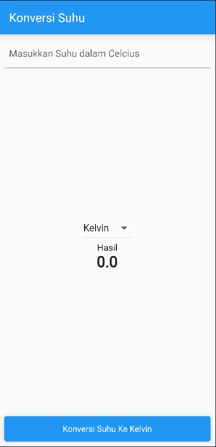
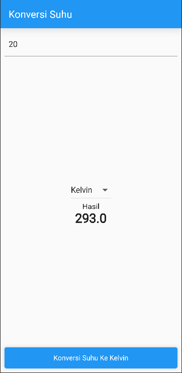

# statefulwdgt

A new Flutter project.

## Getting Started

This project is a starting point for a Flutter application.

A few resources to get you started if this is your first Flutter project:

- [Lab: Write your first Flutter app](https://docs.flutter.dev/get-started/codelab)
- [Cookbook: Useful Flutter samples](https://docs.flutter.dev/cookbook)

For help getting started with Flutter development, view the
[online documentation](https://docs.flutter.dev/), which offers tutorials,
samples, guidance on mobile development, and a full API reference.

## Bab 3 Submission

---

Hasil dari praktikum bab ke 3

### Kondisi pertama

pada kondisi ini filed kosong dan hasil tidak menunjukkan apa apa.

### Kondisi kedua

pada kondisi ini akan menampilkan hasil dari kelvin dan reamur, jika field celcius diisikan.

## Bab 4 Submission

---

hasil dari praktikum Bab 4

### Kondisi Pertama

kondisi awal aplikasi

### Kondisi Kedua

kondisi ketika dropdown diubah menjadi kelvin

### Kondisi Ketiga

Kondisi ketika dropdown diganti menjadi celcius

