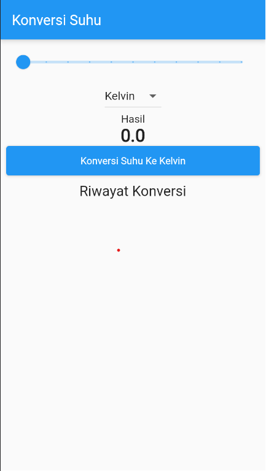
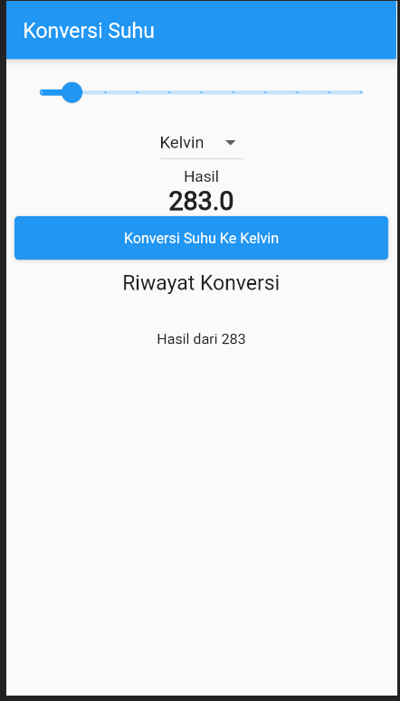
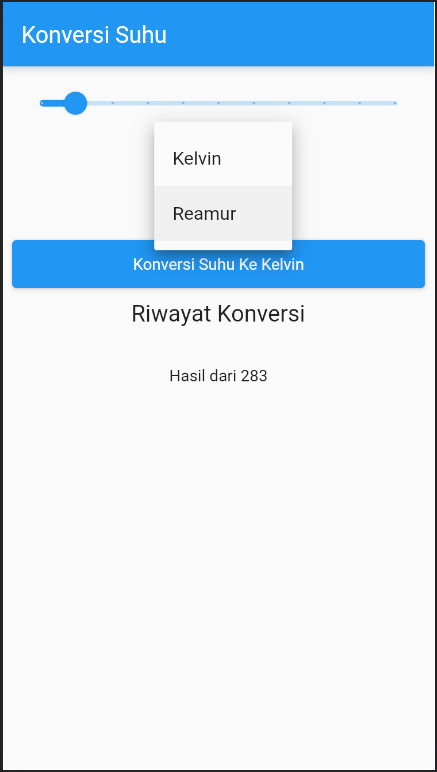
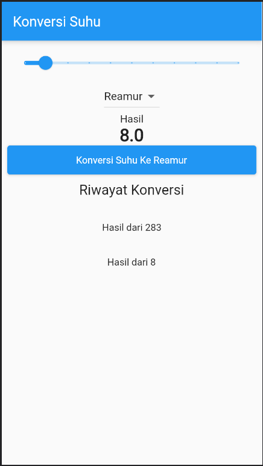

# TUGAS Praktikum 1

---

### Soal

`Kalian ubah proses pada aplikasi sehingga dapat memproses ketika ada perubahan dropdown tanpa di klik konversi suhu.`

### Hasil

Kondisi Ketika Slider 0

Kondisi ketika slider berubah arah

Kondisi ketika dropdown dipindahkan ke reamur

